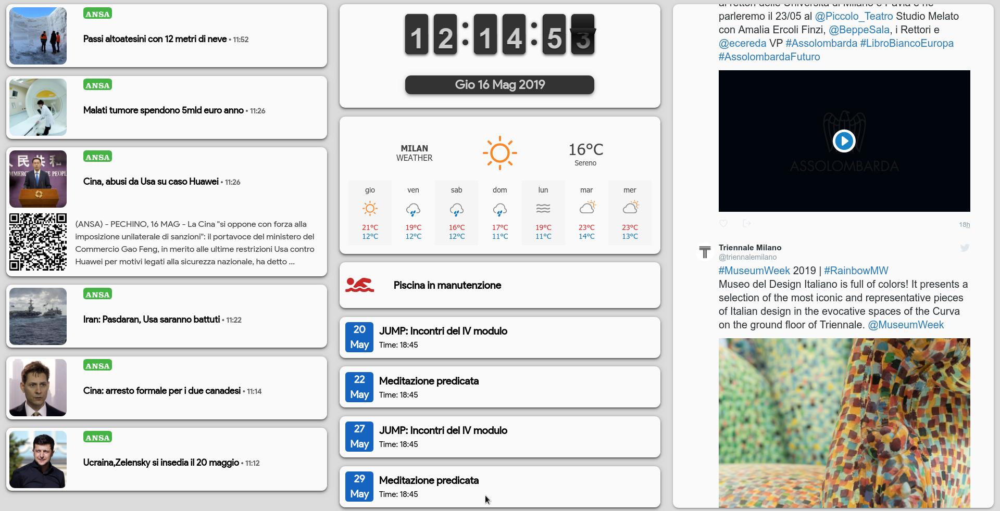

# Sophia Showcase 🌐

A lightweight web dashboard that aggregates information from multiple sources: news, Google Calendar events, weather forecasts, Twitter feeds, and more.  
Stylish, modular, and easy to extend—ideal as a personal or demo front-end.

## 🔍 What It Does

- Shows recent **news** from configurable RSS / API endpoints  
- Displays **Google Calendar events** in a clean timeline view  
- Retrieves current **weather forecasts** for a selected location  
- Embeds **Twitter feed(s)** for selected accounts or hashtags  
- Responsive layout: works well on desktop and mobile

## 🛠️ Tech Stack & Structure

- **HTML / CSS / JavaScript** (vanilla + small libs)  
- Organized into folders:
  - `js/` — scripts to fetch data and update UI  
  - `css/` — styling and responsive layout  
  - `res/` — resources static (images, icons, etc.)  
  - `src/flipclock/` — custom flip clock component  
  - `exampleimg/` — sample images for layout/prototyping

- Uses CORS-friendly public APIs (news, weather, Twitter, Google Calendar)  
- Modular JS so each widget (news, weather, calendar, twitter) is self-contained

## 🔐 Configuration & Customization

* Data source endpoints (news API, weather API, Twitter handles, calendar IDs) are configurable in JS files.
* Change location settings for weather.
* Modify CSS to adjust branding, layout, styles.
* Flip-clock widget theme customizable via its own CSS/JS.
